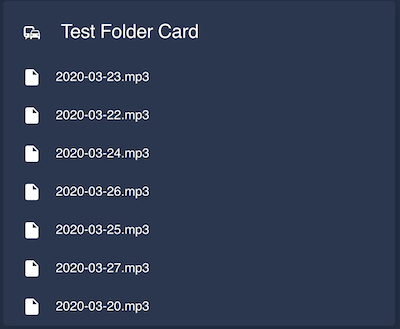

# Folder Card by [@georgesg](https://www.github.com/georgesg)

[![GitHub Release][releases-shield]][releases]
[![License][license-shield]](LICENSE)
![Project Maintenance][maintenance-shield]
[![GitHub Activity][commits-shield]][commits]
[![hacs_badge][hacs-shield]][hacs]


## Overview

This is a [Lovelace](https://www.home-assistant.io/lovelace) card for [Home Assistant](https://www.home-assistant.io/) that displays files listed by a [Folder sensor](https://www.home-assistant.io/integrations/folder/).

If you define a `call-service` tap_action, the service will receive a `file` variable with the file path of the selected file.




## Installation

Add as a Custom repository in [HACS](https://hacs.xyz) or follow this [guide](https://github.com/thomasloven/hass-config/wiki/Lovelace-Plugins).

```yaml
resources:
  - url: /local/folder-card.js
    type: module

```

## Usage

```yaml
type: "custom:folder-card"
title: "My file list"
icon: "mdi:folder"
entity: sensor.folder
tap_action:
  action: "call-service"
  service: script.use_file
```

## Options

| Name              | Type    | Requirement  | Description                                 | Default             |
| ----------------- | ------- | ------------ | ------------------------------------------- | ------------------- |
| type              | string  | **Required** | `custom:folder-card`                        |                     |
| title             | string  | **Optional** | Card name                                   | `none`              |
| icon              | string  | **Optional** | Card icon                                   | `none`              |
| entity            | string  | **Optional** | [Folder](https://www.home-assistant.io/integrations/folder/) sensor entity | `none`              |
| tap_action        | object  | **Optional** | Action to take on tap                       | `none`              |

## Action Options

| Name            | Type   | Requirement  | Description                                                                                                                                                                        | Default     |
| --------------- | ------ | ------------ | -----------------------------------------------------------------------------------------------------------------------------------------------------------------------------------| ----------- |
| action          | string | **Required** | Action to perform (more-info, toggle, call-service, navigate url, none)                                                                                                            | `none`      |
| navigation_path | string | **Optional** | Path to navigate to (e.g. /lovelace/0/) when action defined as navigate                                                                                                            | `none`      |
| url             | string | **Optional** | URL to open on click when action is url. The URL will open in a new tab                                                                                                            | `none`      |
| service         | string | **Optional** | Service to call (e.g. media_player.media_play_pause) when action defined as call-service                                                                                           | `none`      |
| service_data    | object | **Optional** | Service data to include (e.g. entity_id: media_player.bedroom) when action defined as call-service. **Automatically adds "file" property with the file addrerss to service_data**. | `none`      |
| haptic          | string | **Optional** | Haptic feedback for the [Beta IOS App](http://home-assistant.io/ios/beta) _success, warning, failure, light, medium, heavy, selection_                                             | `none`      |
| repeat          | number | **Optional** | How often to repeat the `hold_action` in milliseconds.                                                                                                                             | `none`      |


[commits-shield]: https://img.shields.io/github/commit-activity/y/GeorgeSG/lovelace-folder-card.svg?style=flat-square
[commits]: https://github.com/GeorgeSG/lovelace-folder-card/commits/master
[devcontainer]: https://code.visualstudio.com/docs/remote/containers
[license-shield]: https://img.shields.io/github/license/GeorgeSG/lovelace-folder-card.svg?style=flat-square
[maintenance-shield]: https://img.shields.io/maintenance/yes/2020.svg?style=flat-square
[releases-shield]: https://img.shields.io/github/release/GeorgeSG/lovelace-folder-card.svg?style=flat-square
[releases]: https://github.com/GeorgeSG/lovelace-folder-card/releases
[hacs-shield]: https://img.shields.io/badge/HACS-Custom-orange.svg?style=flat-square
[hacs]: https://github.com/custom-components/hacs
